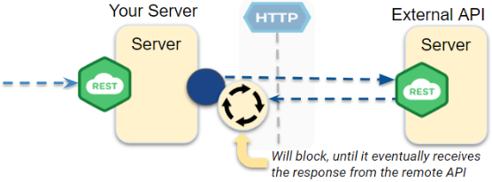
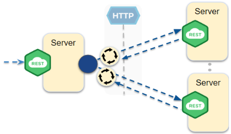
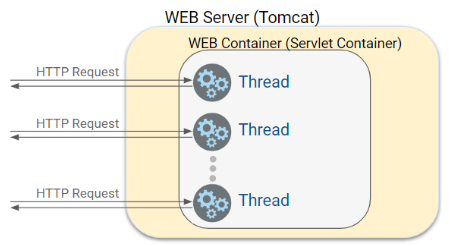

## REST Endpoints using External Services

It is crucial for modern software developers to possess the skills to create not only simple CRUD (Create, Read, Update, and Delete) endpoints but also endpoints that utilise services provided by external APIs, such as for example AI-based ones. This is important for several reasons:

1. **Integration**: In today's interconnected world, many applications rely on third-party services for specialised functionalities. Leveraging external APIs allows developers to integrate advanced features like AI-powered recommendations, natural language processing, or image recognition without building these capabilities from scratch.
2. **Scalability**: External services often come with built-in scalability, enabling applications to handle varying loads without significant modifications. Utilising external APIs allows developers to focus on their core application logic and offload resource-intensive tasks to specialised services.
3. **Cost-effectiveness**: By leveraging external APIs, developers can save time and resources needed to develop, maintain, and scale complex features in-house. This allows organisations to allocate resources more efficiently and focus on their unique value proposition.
4. **Rapid innovation**: Using external APIs for specialised services allows developers to quickly adopt new technologies and stay up-to-date with industry trends. This ensures that their applications remain competitive and cutting-edge in an ever-evolving technological landscape.
5. **Collaboration**: Building endpoints that rely on external services fosters a culture of collaboration and interdependence within the software development community. By using and contributing to external APIs, developers can create more robust and reliable applications, benefiting the entire ecosystem.

When building such systems it's also important to understand the different architectures and protocols that enable effective communication between servers. Two popular approaches for building distributed systems that provide functionality through loosely-coupled services are service-oriented architecture (SOA) and microservices architecture.

**SOA** is an architectural pattern used in large enterprise systems that require a high degree of flexibility and scalability. In an SOA, services are designed to be independent and can be developed and deployed independently. This means that each service can be updated and scaled without affecting the rest of the system.

**Microservices architecture** is a specific approach to implementing SOA that focuses on building small, independent services that can be developed, deployed, and scaled independently. Each microservice typically provides a specific set of functionalities and communicates with other microservices through lightweight protocols such as REST or messaging. Microservices architecture is often used in cloud-native applications, where the ability to quickly adapt to changing business requirements is essential.

While neither the term SOA nor microservices are normally used to describe REST endpoints that rely on external services, they do provide useful principles for building such systems. 

By following the best practices and principles of SOA and microservices, we can design scalable and maintainable distributed systems that rely on external APIs.

Before delving into the design of REST endpoints that depend on external services, let's begin with a refresher on the fundamentals of REST, including its underlying communication protocol, HTTP, and the significance of representing data as resources.

# A quick summary of REST

REST is a protocol for exchanging data between systems over the internet. REST uses HTTP as its underlying communication protocol, which means that REST APIs can be accessed using standard HTTP methods such as GET, POST, PUT, and DELETE.

In a REST architecture, data is represented as resources, and each resource is identified by a unique URI (Uniform Resource Identifier). REST APIs provide endpoints that allow clients to perform operations on resources by sending HTTP requests to those endpoints.

# Designing REST Endpoints that's using external APIs

Due to the reasons already discussed in the introduction to this article, REST endpoints often communicate with other endpoints to provide specialised functionality. For example, a REST endpoint that offers weather information might need to interact with an endpoint that provides geolocation data to determine the user's location. Here are some tips for designing REST endpoints in such a system:

1. Design endpoints around resources: In a REST architecture, endpoints are designed around resources rather than operations. Each endpoint should represent a resource, and the endpoint's URI should identify that resource. For example, a REST endpoint that provides weather information might have the URI /weather. (Even if our endpoint relies on multiple external services, it should still be possible to define your combined response as a resource.)
2. Use HTTP methods appropriately: HTTP offers a set of standard methods that can be employed to perform operations on resources. Use the appropriate HTTP method for each operation. For instance, use GET to retrieve a resource, POST to create a new resource, PUT to update an existing resource, and DELETE to remove a resource.
3. Use JSON for data exchange: JSON (JavaScript Object Notation) is a lightweight data format widely used for data exchange in REST APIs. Utilise JSON to represent resource data in your API. JSON is easy to parse and generate and is supported by most modern programming languages.
4. Handle errors gracefully: In an SOA-like architecture, where REST endpoints depend on other endpoints to provide functionality, ensure your endpoints handle errors gracefully and offer informative error messages to clients.
5. Document your API: Documenting your REST API is crucial for both clients and developers. Use tools like Swagger or OpenAPI to generate documentation for your API. Document each endpoint's URI, HTTP method, and parameters, and provide examples of how to use the endpoint.

## Challenges of REST endpoints relying on external services

When we design endpoints that call other endpoints, we will encounter challenges that may not have been something you have focused on until now. Understanding these issues, and how Tomcat addresses them requires at least a basic understanding of Tomcat's inner workings. 

Let's discuss some of  the potential issues that may arise when our endpoints start to call other services.

Java, in conjunction with the traditional Spring Boot Package we're using, employs a blocking strategy. This means that whenever a method calls another method, the current thread, executing the caller code, will be blocked until the called method returns.

As a result, if our endpoint requests data from an external API that takes a certain amount of time to respond, our endpoint will be blocked until it eventually receives a response, as illustrated below.

This issue becomes even more significant if our endpoint communicates with multiple external endpoints. If each call blocks, we must wait for the first external API to respond, then wait for the second, and so on (If one endpoint's results aren't needed for others, external requests can be performed concurrently which we will discuss later).

Knowing that an endpoint will be blocked while it waits for a method to complete, you might wonder what happens when a server receives multiple simultaneous requests from various clients. Will they all be blocked, forcing their respective clients to wait for the slow endpoint to unblock when it finally returns the response?

Tomcat, along with similar Java Servlet Containers, addresses this issue using threads. For each incoming request, Tomcat assigns the request to a Java Thread responsible for managing all aspects related to that specific request, as depicted below.

Tomcat however, does not spawn a new thread for each request since threads are resource-intensive to create. Instead, Tomcat utilises a thread from a pool of pre-existing threads.

Threads may have been only briefly covered in your education, but for now, you can think of a thread as a "virtual kernel" that, in conjunction with your OS, schedules between an actual physical CPU and a "waiting state" for all threads that are not currently executing on a real CPU.

# Optimising endpoints using external APIs

Continuing our focus on designing endpoints that rely on external APIs, let's investigate some strategies to enhance performance of such endpoints.

**Caching**: Implement caching to minimise calls to external APIs. By caching responses from these APIs for a specific duration, you can serve the cached data for repeated requests during that time. This approach can also be very  cost-effective, as it helps manage expenses or restrictions associated with the external API Services.

**Parallel processing**: Employ parallel processing when API requests can be executed simultaneously, without dependencies. This can significantly improve the overall response time of your endpoint.

**Pagination**: Limit the amount of data returned by the endpoint through pagination. Reducing data processing and transmission can result in faster response times.

Other strategies, such as **streaming**, can also be beneficial. Streaming sends results back to the client as soon as they are available, rather than waiting for all external API responses to be compiled. This allows clients to begin processing data immediately.

For this semester, we will focus on caching, parallelization, and pagination. Streaming is beyond the scope for this semester. To see this in action, try searching on websites like momondo.dk.
